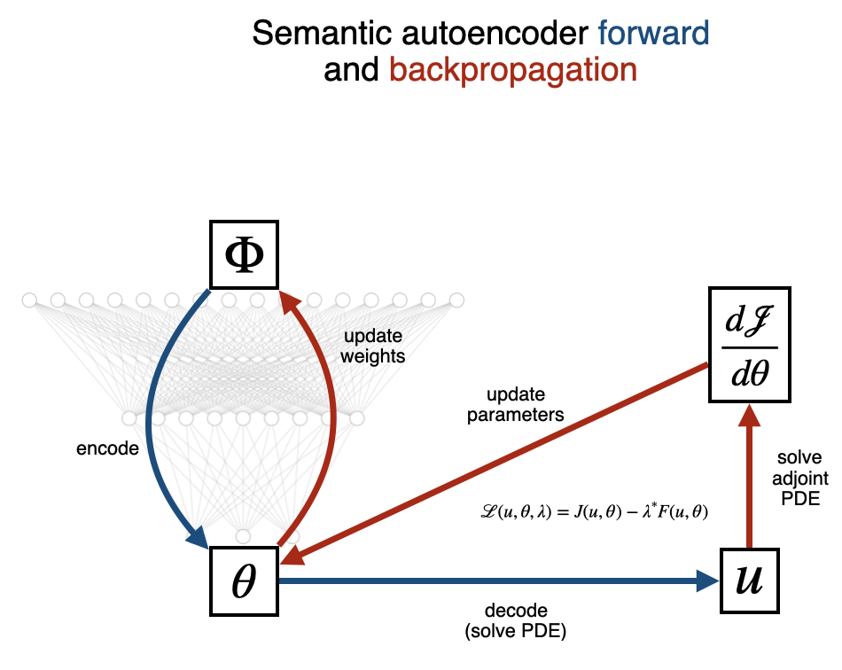

# Semantic Autoencoder for PDE models
This semantic autoencoder is used to solve the following inverse problem:
Given (perhaps noisy) observations of some phenomenon which is modeled as 
a solution to a known partial differential equation (PDE) 
with unknown parameters `theta`, can we infer `theta`?

The semantic autoencoder merges Tensorflow 2 and FEniCS, 
a finite element method package.
Tensorflow encodes the observations to a latent space that represents `theta`,
then FEniCS decodes `theta` to reproduce the observations according to the PDE model.
Unsupervised training is performed by comparing the observations with those 
produced by the network, thereby training the network to learn `theta`.

## Adjoint Poisson's Equation Gradient Descent Usage
See [this notebook](adjoint_PDE.html) for a thorough demonstration.

## Supervised Encoding Usage
**Requirements:** Tensorflow 2.2 and scikit-learn 0.23.1

See [this notebook](poisson_encoder.html) for a demonstration.

The `equations/` directory contains some example config files.
There are four requirements for the config files:
 1. `theta_names` is a list of strings representing names for each parameter in `theta`
 2. `domain()` is a function that returns the domain for the PDE
 3. `solution(theta)` is a function that calculates the analytic solution to the PDE
 as it depends on `theta`.
 4. `theta(replicates)` is a function that simulates `theta` from a prior distribution.

With a config file containing these, such as `equations/poisson.py`,
one simply needs to run

`python train_encoder.py --trainon poisson`

and observe the encoder will be trained.
You will find plots of the predicted vs true `theta` values in
`logs/fit/{datetime}/` where `datetime` is the date and time 
at which the encoder was trained.

A more detailed example of training using `poisson.py` is
worked through in `poisson_encoder_example.ipynb`.
